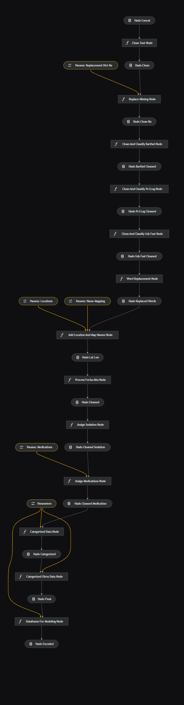

<h1 align="center">
HADO CARES: Healthcare Data Analysis with Kedro
</h1>

## Overview

`HADO_CARES` embarks on a meticulous journey through healthcare data, utilizing the Kedro framework to orchestrate a coherent, insightful, and reproducible data science workflow. From initial data scrutiny to implementing sophisticated machine learning models, this project threads through various stages of data analysis, offering a structured, transparent, and replicable methodology encapsulated in a series of Python scripts and Jupyter notebooks.

#### Context and Problem

The HADO area of the Santiago de Compostela hospital especialized in paliative cares, manages patient records, among other ways, manually using Excel spreadsheets. This methodology, although functional, leads to a lack of standardization in data formats and limited utilization of the collected information, further hampered by the absence of an efficient system to process and analyze the data in a comprehensive and cohesive manner.


### Objectives

The main objective of this project is to enhance the current patient monitoring process in HADO by:
- Conducting exploratory data analysis (EDA) with a special focus on primary diagnostics.
- Identifying trends and classifying high-cardinality variables.
- Applying Natural Language Processing (NLP) and modeling techniques to group and classify variables.
- Creating an application for visualizing the transformed and analyzed data, thus assisting in the decision-making process of HADO professionals.

## Getting Started

### Prerequisites

- Python 3.10
- Kedro 0.18.13

### Installation & Usage

1. Clone the repository
   
   ```sh
   git clone https://github.com/pablovdcf/TFM_HADO_Cares.git
   ```

2. Navigate to the project `hado` folder 

   ```sh
   cd TFM_HADO_Cares/hado
   ```

3. Install dependencies for kedro:
   
   ```sh
   pip install -r src/requirements.txt
   ```

4. Install dependencies for streamlit app:
   
   ```sh
   pip install -r hado_app/requirements.txt
   ```

5. You will need the files to run Kedro pipelines in the path `hado/data/01_raw/`
   
   ```sh
   files = (['Estadística 2017.ods', 'Estadistica 2018.ods', 'HADO 19.ods', 'HADO 20.ods', 'HADO 22.ods'])
   ```
   
6. Run the Kedro pipeline:
   
   ```sh
   kedro run
   ```

7. Explore notebooks in `hado/notebooks` for detailed data analysis and visualizations.

8. Run the streamlit app:
   ```sh
   streamlit run hado_app/app.py
   ```

If you have the data to run the notebooks install the requirements:
   
   ```sh
   pip install -r notebooks/requirements.txt
   ```

## [Kedro Pipelines](https://github.com/pablovdcf/TFM_HADO_Cares/tree/main/hado/src)

### 1.Data Preprocessing Pipeline
The data preprocessing pipeline is defined in [data_preprocessing/pipeline.py](https://github.com/pablovdcf/TFM_HADO_Cares/blob/main/hado/src/hado/pipelines/data_preprocessing/pipeline.py) and involves several nodes, such as `check_convert_and_concat(**dataframes)`, which are defined in [data_preprocessing/nodes.py](https://github.com/pablovdcf/TFM_HADO_Cares/blob/main/hado/src/hado/pipelines/data_preprocessing/nodes.py). Parameters are configured in [data_preprocessing.yml](https://github.com/pablovdcf/TFM_HADO_Cares/blob/main/hado/conf/base/parameters/data_preprocessing.yml).

  
   Through different files I normalize, rename, remove outliers from the columns through the parameters of the file `data_preprocessing.yml` and finally concat them to work with only a unique DataFrame.


### 2.Data Processing Pipeline
The data processing pipeline, defined in [data_processing/pipeline.py](https://github.com/pablovdcf/TFM_HADO_Cares/blob/main/hado/src/hado/pipelines/data_processing/pipeline.py), includes nodes like `clean_text(df: pd.DataFrame)` and `replace_missing(df: pd.DataFrame, params: Dict)`, which are defined in [data_processing/nodes.py](https://github.com/pablovdcf/TFM_HADO_Cares/blob/main/hado/src/hado/pipelines/data_processing/nodes.py). Parameters are set in [data_processing.yml](https://github.com/pablovdcf/TFM_HADO_Cares/blob/main/hado/conf/base/parameters/data_processing.yml).

New variables are added through the data such as the different drugs used as `morphine`, the values for the health scales are classified, a replacement and mapping is done through lists and dictionaries for different variables and a clean DataFrame and another one with One-Hot encoding is prepared for later use in the notebooks and modeling.



### 3.Data Science Pipeline
The data science pipeline, defined in [data_science/pipeline.py](https://github.com/pablovdcf/TFM_HADO_Cares/blob/main/hado/src/hado/pipelines/data_science/pipeline.py), encompasses nodes like `preprocess_split_data(data: pd.DataFrame, parameters)`, `train_clf_model(X_train: pd.DataFrame, y_train: pd.Series, model_options: Dict[str, Any])`, and more, which are defined in [data_science/nodes.py](https://github.com/pablovdcf/TFM_HADO_Cares/blob/main/hado/src/hado/pipelines/data_science/nodes.py). Parameters are configured in 
[data_science.yml](https://github.com/pablovdcf/TFM_HADO_Cares/blob/main/hado/conf/base/parameters/data_science.yml)


Finally, the classification models are run through Random Forest, XGBoost and LightGBM to see which one gives the best result and pass it through the parameters as the best classification model. The confusion matrices are also extracted. For more details go to [data_science.yml](https://github.com/pablovdcf/TFM_HADO_Cares/blob/main/hado/conf/base/parameters/data_science.yml).


<br>

## [Streamlit Application](https://github.com/pablovdcf/TFM_HADO_Cares/tree/main/hado/hado_app)

   - **app.py**: A Python script that may serve as the main application or API.


   - **data_processing.py**: Handles data processing within the application, like the csv upload, apply filters, CRUD or generate a pandas profiling report.
 


   - **visualization.py**: Manages data visualization aspects of the application.
You can choose the variables and depending on the categorical or numerical type, different graphs will be reflected, for example:
<br>

A histogram and boxplot for numerical variables.

<br>

By means of a bubble chart with plotly we can see the evolution if we select all the years

<br>

We can also choose Wordcloud by selecting a categorical variable.

<br>

   - **interactive_maps.py**: More visualizations but for another tab "Maps" that handles visualizations for municipalities.
<br>

With folium we can see choroplethic map of Galicia with the municipalities.


And other metrics for the municipalities like the distribution by municipalities for the year selected.
<br>


   - **data_test.py**: Manages the demo data to generate random dataframes to test the application.
<br>

   - **utils.py**: More utilities to add in the application.
<br>

>You can visit the app at the link 👉[hado cares app](https://hado-cares.streamlit.app/) and the [app documentation](https://hado-cares.readthedocs.io/en/latest/streamlit/hado_app.html)

### [Notebooks](https://github.com/pablovdcf/TFM_HADO_Cares/tree/main/hado/notebooks)

   - **1.1.Data cleaning and preprocessing.ipynb**: A notebook for data cleaning and preprocessing. In this notebook you can see the steps to create the first and part of the second pipelines (preprocessing and processing). 

   - **2.1.Diagnostics_analysis.ipynb**: Focuses on the analysis of diagnostics. You will find NLP process, a bit of dash app, clustering, PCA and more EDA.

   - **4.Insights_and_categories**: Here you will find the insights extracted by the clasiffication and EDA process.
  
   - **6.Clasification_Models.ipynb**: Deals with classification models.
  
   - **8.Models.ipynb**: Contains various models for data analysis.

   - **9.Temporal_Analysis.ipynb**: Focuses on temporal data analysis.

   - **10.Clustering.ipynb**: All the clustering process with DBSCAN and Outliers management.

#### NLP Notebooks

   - **1.Analisis_NLP_HADO.ipynb**: Analyzes data using NLP.

   - **2.Validacion_Interna_Clustering.ipynb**: Handles internal validation of clustering.

   - **3.Validacion_Externa_Clustering.ipynb**: Manages external validation of clustering.

   - **4.Stability_Validation_Clustering.ipynb**: Focuses on stability validation of clustering.

   - **5.PCA_and_Clustering_Visualization.ipynb**: Visualizes PCA and clustering.

   - **6.Cross_Method_Comparison_Clustering.ipynb**: Compares clustering across different methods.


#### General Data Description
   - **Volume of Data**: 4,013 patient records over six years.
   - **Data Characteristics**: Inconsistencies in column names, variability in columns, categorical and numerical data, and presence of null values.
   - **Data Quality**: Issues with missing data, data consistency, and variable cardinality.
   
#### Implemented Solutions and Strategies
   - **Data Standardization**: Creating a unified dataset by concatenating and standardizing annual datasets.
   - **Text Processing and Data Handling**: Employing text processing and data handling techniques to clean and transform variables.
   - **Handling NA Values**: A strategy for handling NA values was proposed, based on the nature of each variable and clinical context.
   - **Use of Kedro**: Facilitated a robust and reproducible data science workflow.

#### Future Challenges and Considerations
   - Emphasis on automation, developing sophisticated predictive strategies for handling missing data, and deeper data analysis in subsequent stages.
   
#### Methodology
   - **Techniques and Methodologies**: Implementation of machine learning techniques and statistical methodologies.
   - **Proposed Data Cleaning Strategies**: Including standardization of column names, handling null values, data type conversion, and text normalization.
   - **Data Science Workflow**: Detailed steps for data preprocessing, exploratory data analysis (EDA), data transformation, statistical analysis, modeling, and result communication.  


<!-- ## Contributing

Kindly refer to [CONTRIBUTING.md](CONTRIBUTING.md) for guidelines on contributions, and feel free to open issues or pull requests. -->

## Contact

- **Contact**: Pablo Villar del Castillo Fernandez - [Email](mailto:pablovdcf@gmail.com)